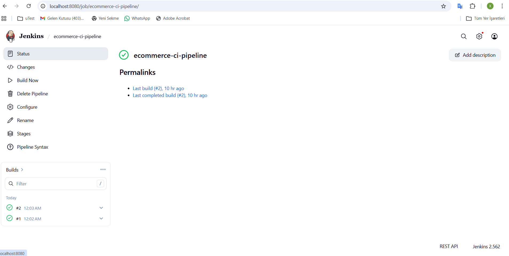

# 🧪 Web Shop Test Automation Framework

A **UI + API Test Automation Framework** built using **Java, Selenium WebDriver, TestNG, and Rest Assured**, following the **Page Object Model (POM)** design pattern.

This project demonstrates real-world automation skills covering both **frontend (UI)** and **backend (API)** testing, along with **CI/CD integration using Jenkins**.

---

## 🚀 Tech Stack

* Java 17
* Selenium WebDriver
* TestNG
* Rest Assured (API Testing)
* Maven
* ExtentReports
* Jenkins (CI/CD)

---

## 🌐 Application Under Test

**UI:**
https://demowebshop.tricentis.com

**API:**
https://reqres.in

---

## 🏗️ Framework Design

* Page Object Model (POM) for UI automation
* Separate API layer using Rest Assured
* Reusable **BaseTest** for setup and teardown
* Centralized configuration management
* Extensible and maintainable architecture
* Integrated reporting with ExtentReports

---

## 🔄 CI/CD Integration

This project is integrated with **Jenkins** for continuous integration.

* Automated test execution via pipeline
* GitHub repository integration
* Scalable for future CI/CD improvements



---

## 📁 Project Structure

```
src
├── main/java
│   ├── pages        # UI Page Objects
│   ├── api          # API client classes
│   ├── config       # Config reader
│   └── utils        # Helpers & reporting
│
├── test/java
│   ├── ui_tests     # UI test cases
│   └── api_tests    # API test cases
│
└── base             # BaseTest (setup/teardown)

test-output           # Test reports
pom.xml               # Dependencies
```

---

## 🧪 Test Coverage

### UI Tests

* User Registration
* Login / Logout
* Add to Cart
* Remove from Cart

### API Tests

* GET user details
* POST login / authentication
* Validate response status codes
* Basic response validation

---

## ⚙️ Key Features

* Combined **UI + API automation framework**
* Page Object Model (POM) architecture
* Reusable test setup (BaseTest)
* REST API automation using Rest Assured
* HTML reporting with ExtentReports
* CI/CD integration with Jenkins
* Scalable and maintainable design

---

## 📊 Reporting

ExtentReports generates detailed HTML reports including:

* Test status (Pass / Fail / Skip)
* API request & response logs
* UI step logs
* Execution time
* Error details with stack trace

---

## ▶️ How to Run Tests

### IntelliJ IDEA

Run tests from:

* `ui_tests` package
* `api_tests` package

### Maven CLI

```
mvn clean test
```

---

## 🔮 Future Improvements

* Data-driven testing (JSON / Excel)
* Parallel test execution
* Cross-browser testing
* Advanced API validation (schema & contract testing)
* Docker integration
* Enhanced CI/CD pipelines

---

## 👩‍💻 Author

**QA Automation Engineer**
Manual Testing | Selenium | Java | TestNG | POM | API Testing (Rest Assured) | Jenkins
